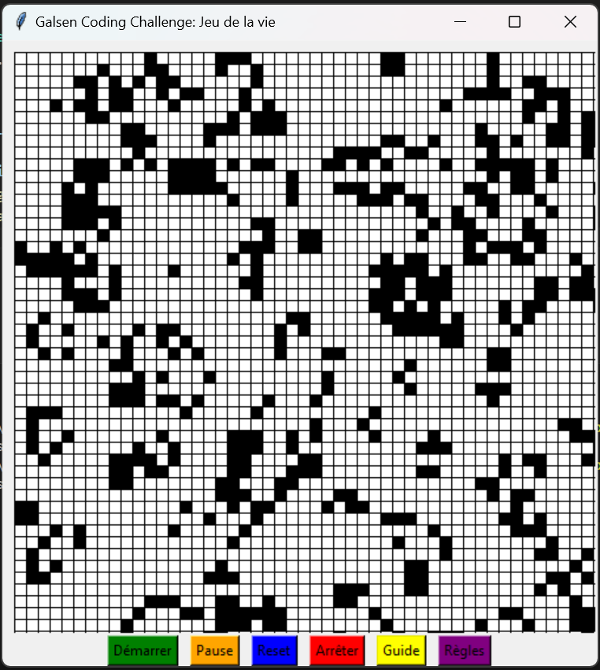

# Jeu de la Vie de John Conway

Ce projet est une implémentation du Jeu de la Vie de John Conway en Python avec une interface utilisateur utilisant Tkinter.

## Architecture du Projet

Le projet est conçu en suivant les principes SOLID pour assurer une conception robuste et modulaire. Les modules incluent :

- **main.py**: Point d'entrée de l'application.
- **models/cellule.py**: Définit la classe `Cell` suivant le principe de responsabilité unique (S - Single Responsibility Principle).
- **controllers/game_logic.py**: Logique principale du jeu, respectant les principes d'ouverture/fermeture (O - Open/Closed Principle) et d'inversion de dépendance (D - Dependency Inversion Principle).
- **views/game_ui.py**: Interface utilisateur graphique (GUI) avec Tkinter, suivant le principe d'inversion de dépendance en utilisant des dépendances abstraites.

## Fonctionnalités

- Création d'une grille de jeu avec des cellules vivantes et mortes.
- Interactivité : cliquez sur une cellule pour changer son état.
- Boutons pour démarrer, mettre en pause, réinitialiser et arrêter le jeu.
- Affichage des règles du Jeu de la Vie et d'un guide d'utilisation.
- Logique de jeu basée sur les règles de Conway.

## Capture d'Écran

## Comment Exécuter le Projet

1. Assurez-vous d'avoir Python installé sur votre système.
2. Clonez ce dépôt sur votre machine.
3. Naviguez dans le répertoire du projet.
4. Exécutez `python main.py` dans votre terminal.

## Remarques

- Le bouton "Démarrer" lance le jeu, évoluant automatiquement la grille.
- Le bouton "Pause" met en pause l'évolution.
- Le bouton "Arrêter" stoppe complètement le jeu.
- Les boutons "Règles" et "Guide" affichent des popups informatifs.

## Principes SOLID Respectés

### 1. Principe de Responsabilité Unique (S - Single Responsibility Principle)
Chaque classe a une responsabilité unique. Par exemple, la classe `Cell` gère l'état individuel des cellules.

### 2. Principe d'Ouverture/Fermeture (O - Open/Closed Principle)
Le module `game_logic.py` est conçu pour être ouvert à l'extension (ajouter de nouvelles fonctionnalités) tout en étant fermé à la modification (l'implémentation existante n'est pas modifiée).

### 3. Principe de Substitution de Liskov (L - Liskov Substitution Principle)
Les classes dérivées (par exemple, `Cell` dans `cellule.py`) peuvent être utilisées de manière interchangeable avec leurs classes de base.

### 4. Principe d'Interface Ségrégée (I - Interface Segregation Principle)
Les interfaces sont spécifiques aux besoins des classes clientes, évitant ainsi une interface trop large.

### 5. Principe d'Inversion de Dépendance (D - Dependency Inversion Principle)
Les dépendances sont inversées, favorisant l'utilisation de dépendances abstraites. Par exemple, la logique du jeu dépend d'interfaces plutôt que d'implémentations concrètes.

## Auteur

Aboubakry BA
